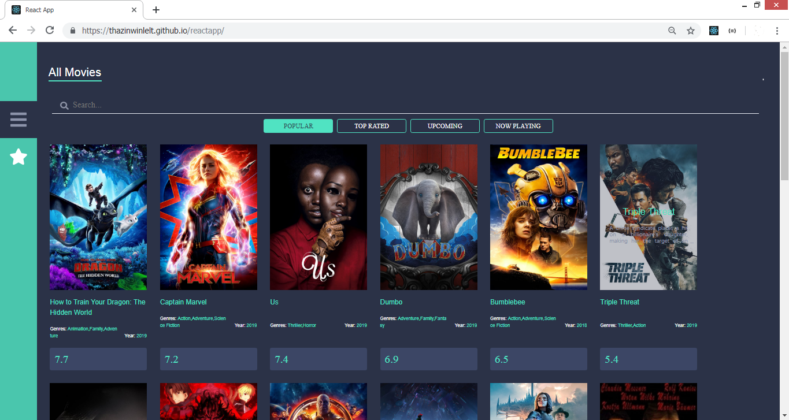
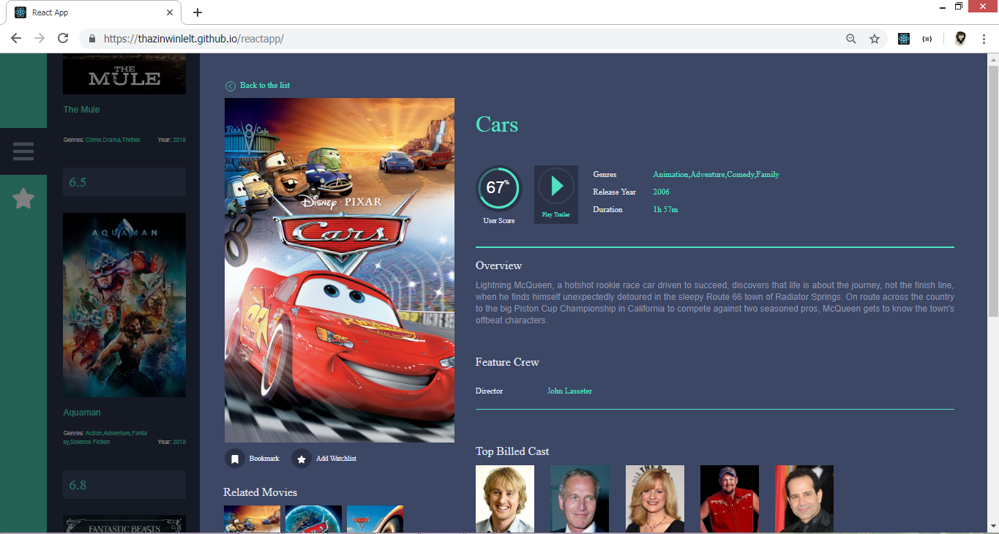
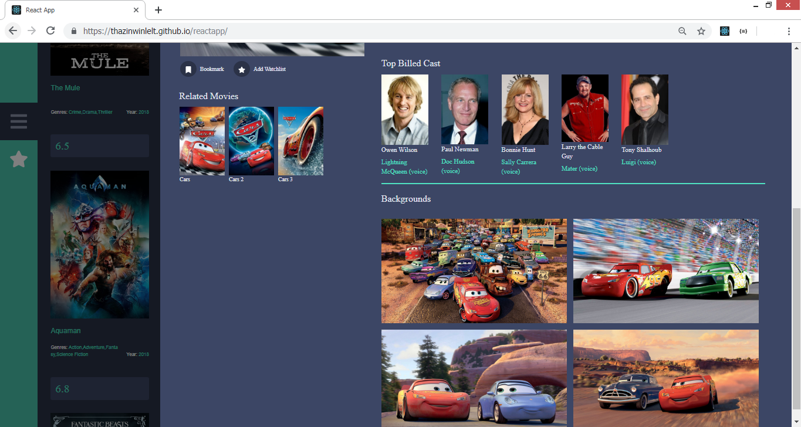
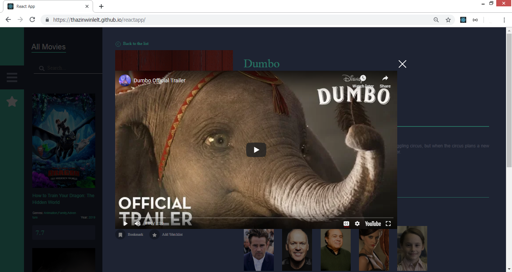
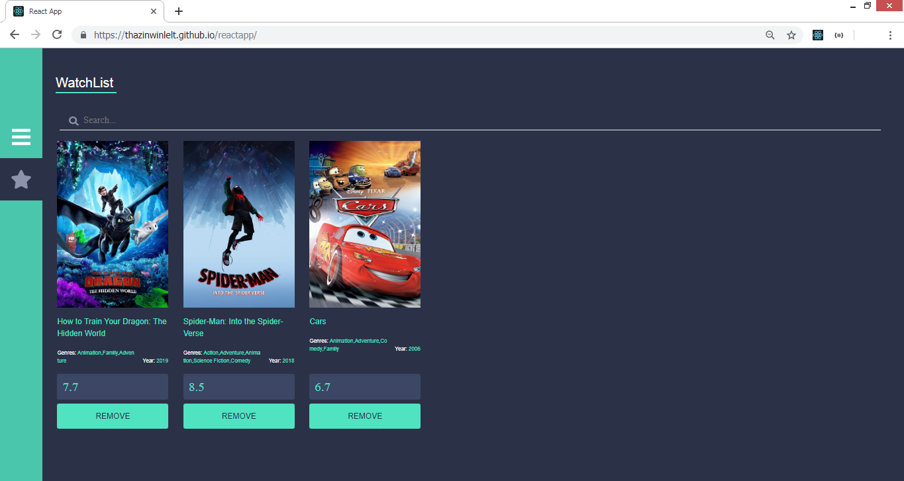

### Project Name

My very first react project using TMDb API

### General info

A small, responsive single-page application which provides visitors the ability to browse and interact with an online catalog of movies.

### Screenshots

`you can search Popular, Top-rated, Upcoming and Now Playing movies.`

`you can see the movie detail and you can also watch trailer`

`you can also add movie to watch list`

### I have installed the following NPM packages

- npm i -g create-react-app
- npm i jquery
- npm i reactstrap
- npm install react-chartjs-2 chart.js –save
- npm install chartjs-plugin-annotation –save
- npm i bootstrap
- npm install react-modal-video
- npm i react-icons
